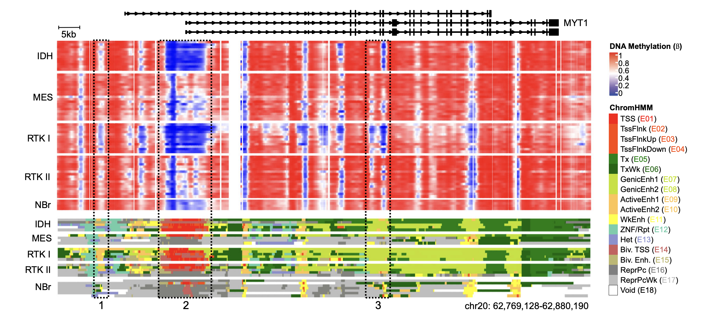
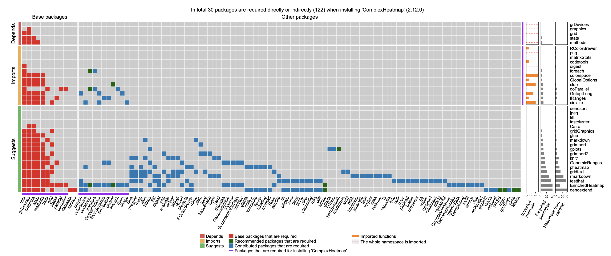

我们研究的核心是应用数据科学的方法。

## 组学与精准医学

基于公共数据库及合作项目数据，开展以下四方面的多组学研究：1. 寻找新的肿瘤分子标志物。申请人开发了非监督机器学习的统计方法及软件工具（Nucleic Acids Research 2021; Briefings in Bioinformatics 2022），可发现肿瘤新亚型及分子标志物，具备更加显著的预后差异。2. 多组学多模态，单细胞和其他组学集成分析。3. 以大语言模型为核心，提升基因功能注释的准确性与通用性。前期工作有BMC Genomics 2025; Bioinformatics 2023; Genomics, Proteomics and Bioinformatics 2023。4. 将研究成果转化为高质量软件工具，支撑社区共享与下游应用。

## 生物软件和社区建设

生物软件在精准医学，人工智能和生物大数据分析中发挥着基础核心作用。申请人具备丰富的超过15年的开发与实战经验，软件涵盖数据建模、可视化、注释、教学与开发者工具，在全球范围被科研机构和医药公司广泛使用，具有较强影响力。

## 计算几何与应用

[空间填充曲线](https://en.wikipedia.org/wiki/Space-filling_curve)（Space-filling curve）作为一种维度映射工具，可以将一维序列折叠为二维或高维结构，同时保持数据点之间的局部邻近性。
本方向将以空间填充曲线为研究对象，围绕基础数学理论的建立、生物数据的应用和转化平台的开发，系统开展从原理探索到实际应用的完整研究工作。

## 软件生态系统

本方向从开发者视角出发，针对软件生态系统中依赖复杂与传播脆弱等核心问题，基于我们前期原创提出的依赖重量（dependency heaviness）理论方法，拟进一步完善其理论体系，并拓展至多语言生态系统的实证研究与应用。依赖重量能够定量刻画单个父包对子包引入的独占性依赖负担，弥补了现有研究中宏观分析与实际开发实践之间的鸿沟，使依赖研究真正服务于开发者的依赖优化与风险评估。本项目将从应用实践与实证分析两方面展开。首先，开发通用的跨编程语言的依赖重量分析核心软件和在线可视化平台，为全球开发者社区提供直接可操作的依赖优化与生态健康度评估工具。其次，系统比较主流编程语言生态系统的依赖传播模式与演化规律，揭示生态复杂性的共性与差异。本研究拓展了软件生态系统依赖分析的方法论，构建了从理论模型、算法工具到跨生态验证的完整研究路径，为开源社区的可持续治理与国家关键软件生态安全提供原创方法与技术支撑。

## 科学计量学

本项目旨在构建一种新的基于引用富集（citation enrichment）的科学影响力分析框架，以揭示全球科研体系中的结构性偏好与动态演化规律。传统的基于引用数量的评价方法虽然能够反映科学影响的总体规模，但忽略了国家、期刊与研究领域之间的相对偏好差异，难以揭示全球科研体系中潜在的结构分化与知识流动模式。本项目将从基础理论与应用实践两方面展开研究：首先，建立基于随机引用模型的引用富集度统计理论，以消除科学体量的规模效应并量化科学主体间的真实偏好；其次，基于文献数据库数据系统揭示科学影响力在不同科学主体层面的分布特征以及在时间维度上的演化规律；最后，开发开源引用富集分析软件与可视化平台，实现文献数据分析的自动化、全面化和可复现。本研究成果扩展了当前科学计量学的方法论，有助于深入理解全球科研体系的结构特征与演化机制，并为客观的科研评价和国际合作政策提供理论依据与工具支撑。

